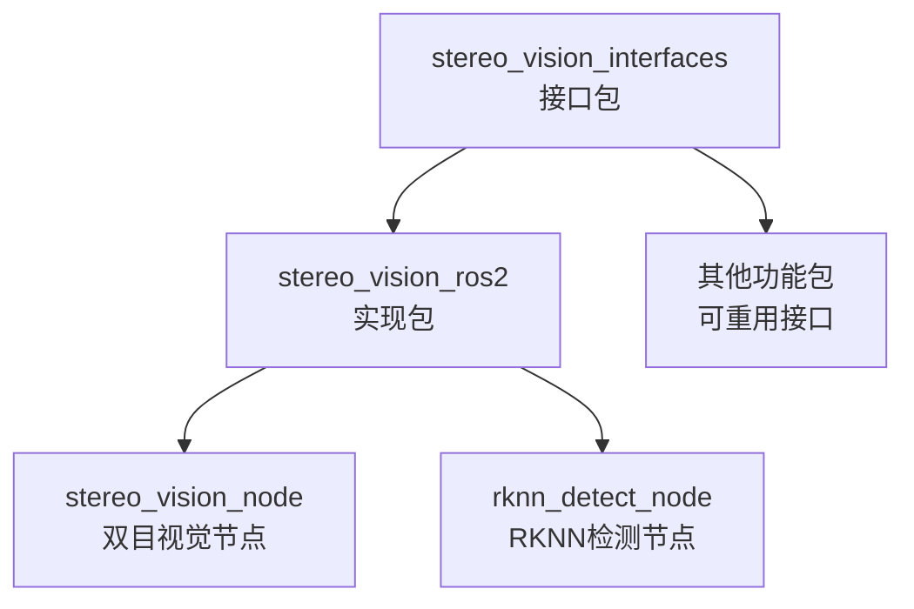

# ROS2双目立体视觉系统 

[](https://docs.ros.org/en/humble/)
[](https://www.python.org/)
[](LICENSE)

基于OpenCV和RKNN的ROS2双目立体视觉系统，实现实时双目测距、服装检测和身体位置估计功能。

## 📋 目录

- [功能特性](#功能特性)
- [系统架构](#系统架构)
- [安装配置](#安装配置)
- [使用方法](#使用方法)
- [API接口](#api接口)
- [测试说明](#测试说明)
- [项目结构](#项目结构)
- [性能指标](#性能指标)
- [常见问题](#常见问题)
- [贡献指南](#贡献指南)

## 🎯 功能特性

### 双目视觉功能
- ✅ **双目测距**: 基于SGBM+WLS算法的高精度立体匹配
- ✅ **实时处理**: 支持30FPS实时图像处理
- ✅ **距离查询**: 提供像素点距离查询ROS2服务
- ✅ **立体校正**: 自动畸变校正和立体校正
- ✅ **点云生成**: 基于Open3D的3D点云可视化（可选）

### RKNN智能检测功能
- ✅ **服装检测**: 基于YOLOv5的13类服装识别
- ✅ **颜色识别**: 智能颜色提取和匹配算法
- ✅ **身体位置估计**: 基于服装检测的身体位置推算
- ✅ **置信度评估**: 提供检测结果的置信度评分
- ✅ **实时推理**: RKNN硬件加速推理

### 支持的服装类别
- 👔 **上装**: 短袖衬衫、长袖衬衫、短袖外套、长袖外套、背心、吊带
- 👖 **下装**: 短裤、长裤、裙子、短袖连衣裙、长袖连衣裙、背心裙、吊带裙

## 🏗️ 系统架构

### 功能包架构
本系统采用分离式架构设计，包含两个功能包：

```
aufoll/src/
├── stereo_vision_interfaces/          # 纯CMake接口包
│   ├── srv/                          # ROS2服务定义
│   │   ├── GetDistance.srv           # 距离查询服务
│   │   ├── DetectImageWithConfidence.srv    # 图像检测服务
│   │   └── DetermineBodyPosition.srv # 身体位置判断服务
│   ├── CMakeLists.txt
│   └── package.xml
└── stereo_vision_ros2/               # 纯Python实现包
    ├── stereo_vision_ros2/           # 核心源码
    │   ├── stereo_vision_node.py     # 双目视觉节点
    │   ├── rknn_detect_node.py       # RKNN检测算法
    │   ├── rknn_detect_node_main.py  # RKNN检测节点
    │   └── test_distance_client.py   # 测试客户端
    ├── launch/                       # 启动文件
    ├── data/                         # 数据文件（RKNN模型）
    ├── test/                         # 测试文件
    ├── docs/                         # 文档文件
    └── resource/                     # 资源文件
```

### 节点架构图

```mermaid
graph TB
    A[双目摄像头] --> B[stereo_vision_node<br/>双目视觉节点]
    C[图像输入] --> D[rknn_detect_node<br/>RKNN检测节点]
    
    B --> E[/stereo_vision/left_image<br/>左摄像头图像话题]
    B --> F[/stereo_vision/disparity<br/>视差图话题]
    B --> G[/stereo_vision/get_distance<br/>距离查询服务]
    
    D --> H[/detect_image_with_confidence<br/>图像检测服务]
    D --> I[/determine_body_position<br/>身体位置判断服务]
    
    J[客户端应用] --> G
    J --> H
    J --> I
```

### 依赖关系



## 🛠️ 安装配置

### 系统要求
- Ubuntu 22.04 LTS
- ROS2 Humble
- Python 3.8+
- OpenCV 4.5+
- 双目摄像头设备

### 依赖安装

#### 1. ROS2基础依赖
```bash
sudo apt update
sudo apt install ros-humble-desktop-full
sudo apt install python3-colcon-common-extensions
```

#### 2. Python依赖
```bash
pip3 install opencv-python numpy scipy pillow scikit-learn
```

#### 3. 可选依赖
```bash
# Open3D点云可视化（可选）
pip3 install open3d

# RKNN Lite推理引擎（硬件相关）
# 请参考官方文档安装对应平台的RKNN Lite
```

### 编译安装

#### 1. 克隆代码
```bash
cd ~/ros2_ws/src
git clone <repository_url>
```

#### 2. 安装ROS依赖
```bash
cd ~/ros2_ws
rosdep install --from-paths src --ignore-src -r -y
```

#### 3. 编译
```bash
# 完整编译
colcon build --packages-select stereo_vision_interfaces stereo_vision_ros2

# 或者分步编译
colcon build --packages-select stereo_vision_interfaces
colcon build --packages-select stereo_vision_ros2

# 设置环境变量
source install/setup.bash
```

## 🚀 使用方法

### 快速启动

#### 1. 启动双目视觉系统
```bash
# 使用launch文件启动
ros2 launch stereo_vision_ros2 stereo_vision.launch.py

# 或者分别启动节点
ros2 run stereo_vision_ros2 stereo_vision_node
ros2 run stereo_vision_ros2 rknn_detect_node
```

#### 2. 查看话题和服务
```bash
# 查看话题
ros2 topic list | grep stereo

# 查看服务
ros2 service list | grep -E "(distance|detect|body)"
```

#### 3. 测试功能
```bash
# 测试距离查询
ros2 service call /stereo_vision/get_distance stereo_vision_interfaces/srv/GetDistance "{x: 320, y: 240}"

# 运行测试客户端
python3 test/test_distance_client.py
# 或使用自定义坐标
python3 test/test_distance_client.py 320 240
```

### 启动参数配置

#### launch文件参数
```bash
ros2 launch stereo_vision_ros2 stereo_vision.launch.py \
  camera_id:=1 \
  fps_limit:=30 \
  enable_rviz:=true
```

#### 节点参数
```bash
ros2 run stereo_vision_ros2 stereo_vision_node \
  --ros-args -p camera_id:=1 -p fps_limit:=30
```

## 📡 API接口

### 话题 (Topics)

| 话题名称 | 消息类型 | 方向 | 描述 |
|---------|---------|------|------|
| `/stereo_vision/left_image` | `sensor_msgs/Image` | 发布 | 左摄像头图像 |
| `/stereo_vision/disparity` | `sensor_msgs/Image` | 发布 | 视差图像 |

### 服务 (Services)

#### 1. 距离查询服务
```bash
服务名称: /stereo_vision/get_distance
服务类型: stereo_vision_interfaces/srv/GetDistance

# 请求
int32 x       # 像素x坐标
int32 y       # 像素y坐标

# 响应  
bool success         # 查询是否成功
float64 distance     # 距离值（米）
string message       # 状态信息
```

#### 2. 图像检测服务
```bash
服务名称: /detect_image_with_confidence
服务类型: stereo_vision_interfaces/srv/DetectImageWithConfidence

# 请求
sensor_msgs/Image image    # 输入图像

# 响应
geometry_msgs/Point[] upper_positions      # 上衣位置坐标
geometry_msgs/Point[] lower_positions      # 下装位置坐标
std_msgs/ColorRGBA[] upper_colors         # 上衣颜色列表
std_msgs/ColorRGBA[] lower_colors         # 下装颜色列表
float64[] upper_confidences               # 上衣置信度
float64[] lower_confidences               # 下装置信度
int32 pairs_count                         # 检测服装对数量
bool success                              # 处理成功标志
string message                            # 处理结果消息
```

#### 3. 身体位置判断服务
```bash
服务名称: /determine_body_position
服务类型: stereo_vision_interfaces/srv/DetermineBodyPosition

# 请求
geometry_msgs/Point upper_clothes_coord   # 上衣坐标
geometry_msgs/Point lower_clothes_coord   # 下装坐标
sensor_msgs/Image image                   # 图像数据

# 响应
geometry_msgs/Point[] body_positions     # 身体位置坐标列表
bool success                            # 处理成功标志
string message                          # 处理结果消息
```

## 🧪 测试说明

### 测试文件结构
```
test/
├── test_services.py          # 服务接口测试
├── test_rknn_detect.py       # RKNN检测功能测试
└── test_distance_client.py   # 距离查询测试客户端
```

### 运行测试

#### 1. 服务接口测试
```bash
cd ~/ros2_ws/src/stereo_vision_ros2
python3 test/test_services.py
```

#### 2. RKNN检测测试
```bash
python3 -m pytest test/test_rknn_detect.py -v
```

#### 3. 距离查询客户端测试
```bash
# 使用默认坐标测试
python3 test/test_distance_client.py

# 使用自定义坐标测试
python3 test/test_distance_client.py 320 240
```

#### 3. ROS2标准测试
```bash
colcon test --packages-select stereo_vision_ros2
colcon test-result --verbose
```

## 📁 项目结构

```
stereo_vision_ros2/
├── stereo_vision_ros2/           # 核心源码模块
│   ├── __init__.py              # 模块初始化
│   ├── stereo_vision_node.py    # 双目视觉节点 (1159行)
│   ├── rknn_detect_node.py      # RKNN检测算法 (1431行)
│   └── rknn_detect_node_main.py # RKNN检测节点 (1036行)
├── launch/                      # 启动文件
│   └── stereo_vision.launch.py  # 系统启动文件
├── data/                        # 数据文件
│   └── best3.rknn              # RKNN模型文件
├── test/                        # 测试文件
│   ├── test_services.py         # 服务接口测试
│   ├── test_rknn_detect.py      # RKNN功能测试
│   └── test_distance_client.py  # 距离查询测试客户端 (374行)
├── docs/                        # 文档文件
│   ├── ARCHITECTURE_SUMMARY.md  # 架构总结
│   ├── BUILD_INSTRUCTIONS.md    # 构建说明
│   ├── FINAL_STATUS_UPDATED.md  # 最终状态报告
│   ├── FINAL_STATUS.md          # 状态报告
│   ├── README_UPDATED.md        # 更新说明
│   └── README.md                # 原始说明
├── resource/                    # 资源文件
│   └── stereo_vision_ros2       # 包标识文件
├── package.xml                  # 包配置文件
├── setup.py                    # Python包安装配置
└── README.md                   # 本文档
```

## 📊 性能指标

### 双目视觉性能
- **图像分辨率**: 1280x480 (双目拼接)
- **处理帧率**: 最高30FPS
- **测距精度**: 毫米级精度
- **测距范围**: 0.1m - 10m
- **延迟**: < 50ms

### RKNN检测性能
- **检测精度**: 置信度阈值0.3
- **支持类别**: 13种服装类别
- **颜色识别**: K-means聚类算法
- **推理速度**: 硬件加速推理
- **内存占用**: 优化内存管理

### 系统性能监控
系统内置性能监控工具，实时监控：
- 图像处理时间
- 检测推理时间
- 内存使用情况
- CPU使用率

## ❓ 常见问题

### Q1: 摄像头无法打开
**A**: 检查摄像头设备ID，确保设备连接正常：
```bash
ls /dev/video*
v4l2-ctl --list-devices
```

### Q2: RKNN模型加载失败
**A**: 确保模型文件路径正确，检查RKNN Lite是否正确安装：
```bash
# 检查模型文件
ls -la data/best3.rknn

# 测试RKNN导入
python3 -c "from rknnlite.api import RKNNLite; print('RKNN OK')"
```

### Q3: 服务调用失败
**A**: 确保接口包已正确编译和source：
```bash
# 重新编译接口包
colcon build --packages-select stereo_vision_interfaces
source install/setup.bash

# 检查服务是否可用
ros2 service list | grep stereo
```

### Q4: 图像话题无数据
**A**: 检查节点状态和摄像头权限：
```bash
# 检查节点状态
ros2 node list
ros2 node info /stereo_vision_node

# 检查话题数据
ros2 topic echo /stereo_vision/left_image --once
```

## 🤝 贡献指南

### 开发环境设置
1. Fork本项目
2. 创建功能分支: `git checkout -b feature/amazing-feature`
3. 提交更改: `git commit -m 'Add amazing feature'`
4. 推送分支: `git push origin feature/amazing-feature`
5. 创建Pull Request

### 代码规范
- 遵循PEP 8 Python编码规范
- 使用中文注释说明
- 添加单元测试
- 更新相关文档

### 测试要求
```bash
# 运行所有测试
python3 -m pytest test/ -v

# 代码风格检查
flake8 stereo_vision_ros2/
```

## 📝 更新日志

### v1.0.0 (2024-12-22)
- ✅ 完成架构重构，分离接口与实现
- ✅ 实现双目视觉测距功能
- ✅ 实现RKNN服装检测功能
- ✅ 添加完整的ROS2服务接口
- ✅ 优化错误处理和性能监控
- ✅ 完善测试框架和文档

## 📄 许可证

本项目基于 [MIT License](LICENSE) 开源。

## 👥 作者与贡献者

- **Stereo Vision Team** - *ROS2移植和架构设计*
- **Original Authors** - *核心算法实现*

---

<div align="center">

**🔗 相关链接**

[ROS2官方文档](https://docs.ros.org/en/humble/) | 
[OpenCV文档](https://docs.opencv.org/) | 
[RKNN文档](https://github.com/rockchip-linux/rknn-toolkit2)

</div> 