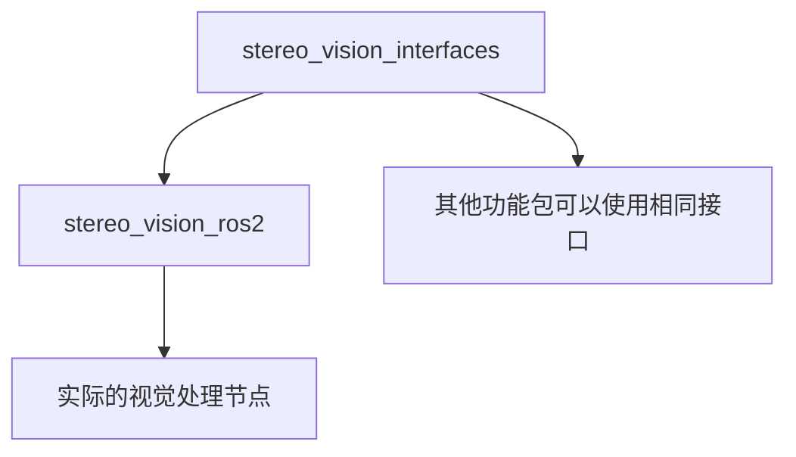

# ROS2双目视觉系统 - 最终架构总结

## 🏗️ 架构重构完成

### ✅ 问题解决

**原问题**: Python和C++混合编译容易出问题，服务接口生成复杂

**解决方案**: 分离接口定义和实现，使用独立的接口功能包

### 📦 新的功能包架构

#### 1. `stereo_vision_interfaces` (纯CMake接口包)
```
stereo_vision_interfaces/
├── CMakeLists.txt          # CMake构建配置
├── package.xml             # 功能包配置
└── srv/                    # 服务定义
    ├── GetDistance.srv
    ├── DetectImageWithConfidence.srv
    └── DetermineBodyPosition.srv
```

**特点**:
- 纯CMake构建系统
- 专门用于生成ROS2接口
- 无Python代码，避免混合编译问题
- 其他功能包可以依赖此接口包

#### 2. `stereo_vision_ros2` (纯Python实现包)
```
stereo_vision_ros2/
├── package.xml             # Python功能包配置
├── setup.py               # Python安装配置
├── stereo_vision_ros2/    # Python源码
│   ├── __init__.py
│   ├── stereo_vision_node.py
│   ├── rknn_detect_node.py
│   ├── rknn_detect_node_main.py
│   └── test_distance_client.py
├── launch/                # 启动文件
├── data/                  # 数据文件
├── test/                  # 测试文件
└── resource/              # 资源文件
```

**特点**:
- 纯Python构建系统 (ament_python)
- 依赖独立的接口功能包
- 简洁的构建过程，无混合编译问题
- 标准ROS2 Python功能包结构

### 🔄 依赖关系



### 🛠️ 构建过程

#### 构建顺序
1. 首先构建接口包：`colcon build --packages-select stereo_vision_interfaces`
2. 然后构建实现包：`colcon build --packages-select stereo_vision_ros2`
3. 或者一次性构建：`colcon build --packages-select stereo_vision_interfaces stereo_vision_ros2`

#### 依赖解析
- ROS2会自动处理依赖关系
- `stereo_vision_ros2`的`package.xml`中声明了对`stereo_vision_interfaces`的依赖
- 构建系统会确保正确的构建顺序

### 📋 接口定义

#### GetDistance.srv
```srv
# 距离查询服务定义
int32 x       # 像素x坐标
int32 y       # 像素y坐标
---
bool success         # 查询是否成功
float64 distance     # 距离值（米）
string message       # 状态信息
```

#### DetectImageWithConfidence.srv
```srv
# 图像检测服务定义
sensor_msgs/Image image
---
geometry_msgs/Point[] upper_positions      # 上衣位置坐标列表
geometry_msgs/Point[] lower_positions      # 下装位置坐标列表
std_msgs/ColorRGBA[] upper_colors         # 上衣颜色列表
std_msgs/ColorRGBA[] lower_colors         # 下装颜色列表
float64[] upper_confidences               # 上衣置信度列表
float64[] lower_confidences               # 下装置信度列表
int32 pairs_count                         # 检测到的服装对数量
bool success                              # 处理成功标志
string message                            # 处理结果消息
```

#### DetermineBodyPosition.srv
```srv
# 身体位置判断服务定义
geometry_msgs/Point upper_clothes_coord   # 上衣坐标
geometry_msgs/Point lower_clothes_coord   # 下装坐标
sensor_msgs/Image image                   # 图像数据
---
geometry_msgs/Point[] body_positions     # 整体身体位置坐标列表
bool success                            # 处理成功标志
string message                          # 处理结果消息
```

### 🎯 使用方法

#### 导入服务接口
```python
# 在Python代码中导入服务
from stereo_vision_interfaces.srv import GetDistance
from stereo_vision_interfaces.srv import DetectImageWithConfidence
from stereo_vision_interfaces.srv import DetermineBodyPosition
```

#### 启动节点
```bash
# 使用ROS2命令启动
ros2 run stereo_vision_ros2 stereo_vision_node
ros2 run stereo_vision_ros2 rknn_detect_node

# 查看可用的可执行文件
ros2 pkg executables stereo_vision_ros2
```

#### 调用服务
```bash
# 距离查询
ros2 service call /stereo_vision/get_distance stereo_vision_interfaces/srv/GetDistance "{x: 320, y: 240}"

# 查看服务列表
ros2 service list | grep stereo
```

### ✨ 优势

1. **清晰分离**: 接口定义与实现完全分离
2. **避免混合编译**: 纯CMake接口包 + 纯Python实现包
3. **可重用性**: 其他功能包可以使用相同的接口定义
4. **易于维护**: 接口变更只需修改接口包
5. **标准化**: 符合ROS2最佳实践
6. **构建稳定**: 避免了Python/C++混合编译的问题

### 🔧 技术细节

#### CMakeLists.txt (接口包)
```cmake
# 生成服务接口
rosidl_generate_interfaces(${PROJECT_NAME}
  "srv/GetDistance.srv"
  "srv/DetectImageWithConfidence.srv" 
  "srv/DetermineBodyPosition.srv"
  DEPENDENCIES std_msgs sensor_msgs geometry_msgs
)
```

#### package.xml (实现包)
```xml
<!-- 接口功能包依赖 -->
<depend>stereo_vision_interfaces</depend>
<export>
  <build_type>ament_python</build_type>
</export>
```

#### setup.py (实现包)
```python
entry_points={
    'console_scripts': [
        'stereo_vision_node = stereo_vision_ros2.stereo_vision_node:main',
        'rknn_detect_node = stereo_vision_ros2.rknn_detect_node_main:main',
        'test_distance_client = stereo_vision_ros2.test_distance_client:main',
    ],
},
```

### 🚀 总结

新的架构解决了原有的混合编译问题，提供了：
- 更清晰的代码组织
- 更稳定的构建过程  
- 更好的可维护性
- 更强的可扩展性

这种架构是ROS2开发的最佳实践，特别适合需要自定义接口的复杂系统。 